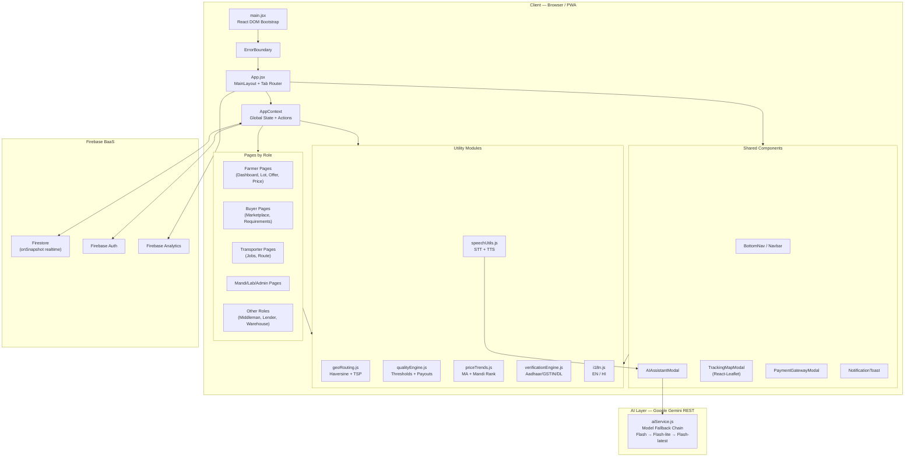

# AgriVa — Architecture Reference

> **Project codename:** KisanSetu · **Production name:** AgriVa (आग्रीवा)
> **Version:** 0.0.0 · **Build tool:** Vite 8 · **Deployed to:** Vercel

---

## Table of Contents

1. [Project Overview](#1-project-overview)
2. [Technology Stack](#2-technology-stack)
3. [Top-Level Directory Structure](#3-top-level-directory-structure)
4. [Application Entry & Bootstrap](#4-application-entry--bootstrap)
5. [Global State — AppContext](#5-global-state--appcontext)
6. [Routing & Navigation Model](#6-routing--navigation-model)
7. [Role System & Persona Model](#7-role-system--persona-model)
8. [Page Modules (by Role)](#8-page-modules-by-role)
   - 8.1 [Farmer / FPO](#81-farmer--fpo)
   - 8.2 [Buyer / Consumer / Bulk Buyer](#82-buyer--consumer--bulk-buyer)
   - 8.3 [Transporter](#83-transporter)
   - 8.4 [Mandi Operator](#84-mandi-operator)
   - 8.5 [Quality Lab](#85-quality-lab)
   - 8.6 [Admin](#86-admin)
   - 8.7 [Middleman](#87-middleman)
   - 8.8 [Lender](#88-lender)
   - 8.9 [Warehouse](#89-warehouse)
   - 8.10 [Shared Pages](#810-shared-pages)
9. [Shared UI Components](#9-shared-ui-components)
10. [Firebase Integration Layer](#10-firebase-integration-layer)
11. [AI & Intelligence Layer](#11-ai--intelligence-layer)
12. [Utility Modules](#12-utility-modules)
13. [Core Business Workflows](#13-core-business-workflows)
    - 13.1 [Requirement → Offer → Order Pipeline](#131-requirement--offer--order-pipeline)
    - 13.2 [Farmer Lot Lifecycle](#132-farmer-lot-lifecycle)
    - 13.3 [Quality Verification Workflow](#133-quality-verification-workflow)
    - 13.4 [Payment & Escrow Flow](#134-payment--escrow-flow)
    - 13.5 [Dispute Resolution](#135-dispute-resolution)
    - 13.6 [Logistics & Route Optimization](#136-logistics--route-optimization)
14. [Data Models (Firestore Collections)](#14-data-models-firestore-collections)
15. [PWA & Offline Architecture](#15-pwa--offline-architecture)
16. [Internationalisation (i18n)](#16-internationalisation-i18n)
17. [Voice & Accessibility Layer](#17-voice--accessibility-layer)
18. [Security & Verification Engine](#18-security--verification-engine)
19. [Build, Deploy & Environment](#19-build-deploy--environment)
20. [Architecture Diagram](#20-architecture-diagram)

---

## 1. Project Overview

AgriVa is a **multi-role, mobile-first Progressive Web App** that digitises the Indian agricultural supply chain. It directly connects:

| Actor | Problem Solved |
|---|---|
| **Farmer / FPO** | Direct market access, fair price discovery, transparent payments |
| **Bulk Buyer** | Aggregated procurement, e-tender management, supplier vetting |
| **Transporter** | Optimised pickup routes, verified job assignments |
| **Mandi Operator** | Digital gate entry, lot tracking, price broadcasting |
| **Quality Lab** | Standardised sample test reporting, certification issuance |
| **Admin** | KYC approval, dispute resolution, fraud prevention |
| **Middleman** | Commission-based deal facilitation with auditability |
| **Lender** | Collateral-backed agri-credit tied to verified produce |
| **Warehouse** | Storage allocation linked to post-harvest orders |

The system runs as a **single-page application** with no traditional server-side rendering. All real-time data synchronisation is powered by Firebase Firestore `onSnapshot` listeners. An AI layer (Google Gemini REST API) provides conversational assistance and demand forecasting.

---

## 2. Technology Stack

| Layer | Technology | Version |
|---|---|---|
| UI Framework | React | 19.3 |
| Build Tool | Vite | 8.3 |
| Styling | Tailwind CSS (v4, Vite plugin) | 4.3 |
| State Management | React Context API (AppContext) | — |
| Backend / DB | Firebase Firestore | 12.19 |
| Authentication | Firebase Auth | 12.19 |
| Analytics | Firebase Analytics | 12.19 |
| AI / LLM | Google Gemini REST API (v1beta) | gemini-3.5-flash |
| Maps | React-Leaflet + Leaflet.js | 5.0 / 1.9 |
| QR Code | qrcode.react | 4.2 |
| Image Compression | browser-image-compression | 2.0 |
| Icons | lucide-react | 1.46 |
| PWA | vite-plugin-pwa (Workbox) | 1.3 |
| Deployment | Vercel | — |
| Language | JavaScript (JSX) + TypeScript (scaffold only) | — |

---

## 3. Top-Level Directory Structure

```
KisanSetu/
├── public/                     # Static assets, PWA icons, favicon
├── src/
│   ├── main.jsx                # React DOM bootstrap
│   ├── App.jsx                 # Root component, layout, role-based routing
│   ├── index.css               # Global CSS + Tailwind directives
│   ├── style.css               # Additional custom styles
│   │
│   ├── context/
│   │   └── AppContext.jsx      # Global state, all business actions
│   │
│   ├── firebase/
│   │   ├── config.js           # Firebase initialisation
│   │   ├── services.js         # Firestore CRUD + onSnapshot helpers
│   │   └── seedData.js         # Initial seed data for collections
│   │
│   ├── services/
│   │   └── aiService.js        # Gemini API client, fallback model chain
│   │
│   ├── utils/
│   │   ├── geoRouting.js       # Haversine distance, nearest-neighbour TSP
│   │   ├── i18n.js             # Translation dictionary (EN / HI)
│   │   ├── priceTrends.js      # Moving average, trend analysis, mandi ranking
│   │   ├── qualityEngine.js    # Crop quality thresholds, weight mismatch tiers
│   │   ├── speechUtils.js      # Web Speech API (STT + TTS)
│   │   ├── translations.js     # Flat translation key map (used by t())
│   │   └── verificationEngine.js # Aadhaar/GSTIN/DL validation algorithms
│   │
│   ├── components/             # Shared, role-agnostic UI components
│   │   ├── AIAssistantModal.jsx
│   │   ├── BottomNav.jsx
│   │   ├── EmptyState.jsx
│   │   ├── ErrorBoundary.jsx
│   │   ├── FpoIntelligenceWidget.jsx
│   │   ├── GlobalVoiceNavigator.jsx
│   │   ├── InspectorVerificationScreen.jsx
│   │   ├── LogisticsAssignmentScreen.jsx
│   │   ├── Navbar.jsx
│   │   ├── NetRealizationWidget.jsx
│   │   ├── NotificationToast.jsx
│   │   ├── PaymentGatewayModal.jsx
│   │   ├── PaymentTimeline.jsx
│   │   ├── PersonaSwitcher.jsx
│   │   ├── ProfileHeader.jsx
│   │   ├── RaiseDisputeModal.jsx
│   │   ├── RatingStars.jsx
│   │   ├── Sidebar.jsx
│   │   ├── TrackingMapModal.jsx
│   │   └── VisualStepper.jsx
│   │
│   └── pages/
│       ├── BlueScreen.jsx       # Debug / diagnostic page (/blue route)
│       ├── SettingsPage.jsx     # User profile & app settings
│       ├── auth/
│       │   └── Onboarding.jsx
│       ├── farmer/
│       │   ├── AddListingModal.jsx
│       │   ├── CreateLotScreen.jsx
│       │   ├── FarmerDashboard.jsx
│       │   ├── LotDetailScreen.jsx
│       │   ├── MakeOfferModal.jsx
│       │   ├── MarketIntelligenceScreen.jsx
│       │   ├── PriceDiscovery.jsx
│       │   ├── QualitySelfDeclarationScreen.jsx
│       │   └── RequirementsFeed.jsx
│       ├── buyer/
│       │   ├── AIDemandForecasting.jsx
│       │   ├── BulkBuyerDashboard.jsx
│       │   ├── BuyerMarketplace.jsx
│       │   ├── BuyerOffersView.jsx
│       │   └── PostRequirementForm.jsx
│       ├── transporter/
│       │   ├── RouteComparisonView.jsx
│       │   └── TransporterDashboard.jsx
│       ├── mandi/
│       │   └── MandiDashboard.jsx
│       ├── lab/
│       │   └── LabDashboard.jsx
│       ├── admin/
│       │   ├── AdminDashboard.jsx
│       │   └── AdminDisputeQueue.jsx
│       ├── middleman/
│       │   └── MiddlemanDashboard.jsx
│       ├── lender/
│       │   └── LenderDashboard.jsx
│       ├── warehouse/
│       │   └── WarehouseDashboard.jsx
│       └── shared/
│           ├── LiveMandiPrices.jsx
│           └── OrderDetailScreen.jsx
│
├── vite.config.js
├── vercel.json
├── package.json
└── tsconfig.json
```

---

## 4. Application Entry & Bootstrap

```
index.html
  └── <div id="root" />
        └── main.jsx
              └── <React.StrictMode>
                    └── <ErrorBoundary>      ← Global crash boundary
                          └── <App />
                                └── <AppProvider>   ← All global state
                                      └── <MainLayout />
```

**`main.jsx`** mounts the React tree with a top-level `ErrorBoundary` to catch any catastrophic render failures and prevent a blank white screen.

**`App.jsx` / `MainLayout`** is the primary layout shell. It:
1. Checks `localStorage` for `agriva_auth_status` → shows `Onboarding` if `false`.
2. Renders `PersonaSwitcher`, `NotificationToast`, `BottomNav`, and conditionally `AIAssistantModal`.
3. Calls `renderActiveScreen()` which uses `currentUser.role` + `activeTab` state to determine which page component to display (tab-based SPA navigation — no React Router).
4. Handles full-screen modal overrides (`MakeOfferModal`, `BuyerOffersView`) before role-based rendering.

---

## 5. Global State — AppContext

**File:** `src/context/AppContext.jsx`

The single source of truth for the entire application. It wraps the app tree in `<AppContext.Provider>` and exposes all collections and mutation functions via the `useApp()` hook.

### Collections (State Slices)

| State Key | Description | Firebase Collection |
|---|---|---|
| `listings` | Farmer crop listings | `listings` |
| `bids` | Bids placed by buyers on listings | `bids` |
| `deliveries` | Active delivery jobs | `deliveries` |
| `loans` | Agri-credit loans | `loans` |
| `labRegistrations` | Lab certification requests | `labRegistrations` |
| `mandiPrices` | Live mandi price broadcasts | `mandiPrices` |
| `priceSnapshots` | Farmer-saved price snapshots | `priceSnapshots` |
| `notifications` | Push notification log | `notifications` |
| `mandiLots` | Lots registered at mandis | `mandiLots` |
| `labCertificates` | Issued lab quality certs | `labCertificates` |
| `registeredUsers` | All KYC-registered users | `users` |
| `fpoApprovals` | Pending FPO KYC approvals | `fpoApprovals` |
| `bulkBuyerApprovals` | Pending GSTIN verifications | `bulkBuyerApprovals` |
| `flaggedRegistrations` | Aadhaar/doc mismatch alerts | `flaggedRegistrations` |
| `suspendedTransporters` | Suspended DL/RC accounts | `suspendedTransporters` |
| `disputes` | Open/closed dispute cases | `disputes` |
| `requirements` | Buyer procurement requirements | `requirements` |
| `offers` | Farmer offers on requirements | `offers` |
| `orders` | Created trade orders | `orders` |
| `farmerLots` | Farmer produce lots (multi-step) | `farmerLots` |

### Mutation Actions (Context Functions)

```
Authentication
  ├── registerUser(userData)          — KYC + role-based registration
  └── switchRole(role)                — Dev-mode persona switcher

Admin Approvals
  ├── approveFpo / rejectFpo
  ├── approveBulkBuyer / rejectBulkBuyer
  ├── resolveFlaggedRegistration
  └── suspendTransporter / reinstateTransporter

Marketplace (Listing → Bid)
  ├── createListing(listingData)      — Creates farmer listing
  ├── placeBid(listingId, bidData)    — Buyer places bid
  └── acceptBid(listingId, bidId)     — Farmer accepts, creates delivery

Requirement → Offer → Order Pipeline
  ├── postRequirement(reqData)        — Buyer posts procurement requirement
  ├── makeOffer(requirementId, data)  — Farmer submits offer with price/qty
  ├── acceptOffer(reqId, offerIds)    — Buyer accepts offers, creates orders
  └── withdrawOffer(offerId)          — Farmer withdraws pending offer

Delivery & Fulfilment
  ├── updateDeliveryStatus(id, status, data)
  ├── completeTransporterDelivery(id, data)
  └── confirmBuyerDelivery(id, data)

Farmer Lot Module
  ├── createLot(lotData)              — Initiates a multi-stage lot
  └── updateLotStatus(id, status, data)

Quality & Lab
  ├── submitQualityLabTest(data)
  ├── approveLabRegistration(id)
  └── rejectLabRegistration(id)

Disputes
  ├── raiseDispute(orderId, data)
  └── resolveDispute(disputeId, resolution)

Mandi
  └── createMandiGateEntry(data)

Utilities
  ├── checkUnderpricing(listingId, price) — Underpricing alert system
  ├── logCallRequest(data)               — IVRS fallback log
  ├── triggerToast(msg, title, type)     — Notification toast
  ├── updatePriceSnapshot(data)
  └── t(key)                             — Translation helper
```

### Data Flow Guarantee

```
UI Action → AppContext mutation fn
    → saveDocument() / updateDocumentFields()   [Firestore write]
        → Firestore cloud store
            → onSnapshot() fires across all clients
                → setStateX() updates React state
                    → Components re-render
```

> **No optimistic local state updates.** All UI state changes come exclusively through the `onSnapshot` callback, guaranteeing multi-device real-time synchronisation.

---

## 6. Routing & Navigation Model

AgriVa uses **tab-based in-memory navigation** (not React Router). Routes are managed by a single `activeTab` state in `MainLayout`.

### Navigation Structure

```
MainLayout
  ├── activeTab = 'dashboard'     → Role-based dashboard (default)
  ├── activeTab = 'prices'        → PriceDiscovery (farmer)
  ├── activeTab = 'feed'          → RequirementsFeed (farmer)
  ├── activeTab = 'createLot'     → CreateLotScreen (farmer)
  ├── activeTab = 'qualityGrading'→ QualitySelfDeclarationScreen (farmer)
  ├── activeTab = 'lotDetail'     → LotDetailScreen (farmer)
  ├── activeTab = 'postReq'       → PostRequirementForm (buyer)
  ├── activeTab = 'offers'        → BuyerOffersView (buyer)
  ├── activeTab = 'buyerOffers'   → BuyerOffersView [full-screen] (buyer)
  ├── activeTab = 'settings'      → SettingsPage (all roles)
  └── showMakeOffer = true        → MakeOfferModal [full-screen] (farmer)
```

### URL-Based Special Routes

Two special pathname checks exist before role switching:
- `/blue` or `/blue-screen` → `BlueScreen` (diagnostic/debug page)

### BottomNav

`BottomNav` renders a role-specific set of tab buttons. It calls `setActiveTab()` on press. Each role sees different nav items:

| Role | Nav Items |
|---|---|
| farmer / fpo | Home, Feed, New Lot, Prices, Profile |
| buyer / bulk_buyer | Home, Post Req, Offers, Profile |
| transporter | Pickups, Smart Route, Alerts, Profile |
| mandi | Home, Gate, Alerts, Profile |
| lab | Tests, Alerts, Profile |
| admin | Home, Alerts, Profile |

---

## 7. Role System & Persona Model

### Available Roles

| Role Key | Display Name | Badge Type |
|---|---|---|
| `farmer` | Farmer | New Seller → Verified Farmer |
| `fpo` | FPO (Farmer Producer Org) | FPO Badge |
| `buyer` | Buyer / Consumer | — |
| `bulk_buyer` | Bulk Buyer / Corporate | GSTIN Verified |
| `transporter` | Transporter / Driver | — |
| `mandi` | Mandi Operator | — |
| `lab` | Quality Lab | Accredited Lab |
| `admin` | Platform Admin | Admin |
| `middleman` | Middleman | — |
| `lender` | Agri Lender | — |
| `warehouse` | Warehouse Operator | — |

### PersonaSwitcher

`PersonaSwitcher` is a **development-mode banner** (visible in demo builds) that allows switching between personas without logging out. It calls `switchRole()` in AppContext, which updates `currentUser.role` globally and resets `activeTab` to `'dashboard'`.

### Trust Score System

Each user has a `trustScore` (0–100) displayed in the profile. Farmer offers carry `sellerTrustScore` (mapped 0–5 from trustScore/20). Trust badges:
- **Verified Farmer** → Aadhaar + field inspection completed
- **New Seller** → registered but not yet verified
- **FPO** → cooperative organisation, batch-aggregation eligible

---

## 8. Page Modules (by Role)

### 8.1 Farmer / FPO

| Page | File | Purpose |
|---|---|---|
| Farmer Dashboard | `pages/farmer/FarmerDashboard.jsx` | Overview of listings, active bids, orders, sales |
| Add Listing | `pages/farmer/AddListingModal.jsx` | Post a new crop listing with photo upload |
| Price Discovery | `pages/farmer/PriceDiscovery.jsx` | Live mandi price feed + best mandi recommender |
| Requirements Feed | `pages/farmer/RequirementsFeed.jsx` | Browse buyer procurement requirements |
| Make Offer | `pages/farmer/MakeOfferModal.jsx` | Submit price/qty offer against a requirement |
| Create Lot | `pages/farmer/CreateLotScreen.jsx` | Step 1 of the multi-stage lot creation flow |
| Quality Self Declaration | `pages/farmer/QualitySelfDeclarationScreen.jsx` | Step 2 — farmer self-declares quality params |
| Lot Detail | `pages/farmer/LotDetailScreen.jsx` | Step 3 — full lot detail + status tracking |
| Market Intelligence | `pages/farmer/MarketIntelligenceScreen.jsx` | AI-powered market insights and trend view |

**FarmerDashboard** key features:
- Tabs: Crops (listings) and Sales (orders/bids)
- Unverified farmer alert banner with KYC CTA
- Accept/Reject bid flow with escrow payment trigger
- Dispute raising on completed orders
- Voice input via microphone button (STT → search/filter)

### 8.2 Buyer / Consumer / Bulk Buyer

| Page | File | Purpose |
|---|---|---|
| Buyer Marketplace | `pages/buyer/BuyerMarketplace.jsx` | Browse and bid on farmer listings |
| Bulk Buyer Dashboard | `pages/buyer/BulkBuyerDashboard.jsx` | Corporate procurement hub, e-tender management |
| Post Requirement | `pages/buyer/PostRequirementForm.jsx` | Create a new procurement requirement |
| Buyer Offers View | `pages/buyer/BuyerOffersView.jsx` | View and accept/reject farmer offers |
| AI Demand Forecasting | `pages/buyer/AIDemandForecasting.jsx` | Gemini-powered crop demand forecasts |

**BulkBuyerDashboard** shows aggregated batches (auto-matched via FPO grouping), active tender count, and tonnage fulfilled. It consumes the `requirements` and `listings` slices.

### 8.3 Transporter

| Page | File | Purpose |
|---|---|---|
| Transporter Dashboard | `pages/transporter/TransporterDashboard.jsx` | Assigned pickups, delivery status management |
| Route Comparison | `pages/transporter/RouteComparisonView.jsx` | Side-by-side route cost comparison |

`RouteComparisonView` uses the `geoRouting.js` nearest-neighbour algorithm to compute optimised pickup routes and compare vs. naive ordering.

### 8.4 Mandi Operator

| Page | File | Purpose |
|---|---|---|
| Mandi Dashboard | `pages/mandi/MandiDashboard.jsx` | Gate entry logging, lot arrival tracking, price updates |

Calls `createMandiGateEntry()` in AppContext to register trucks/lots arriving at the mandi. Broadcasts real-time prices to the `mandiPrices` collection which farmers see in price discovery.

### 8.5 Quality Lab

| Page | File | Purpose |
|---|---|---|
| Lab Dashboard | `pages/lab/LabDashboard.jsx` | Incoming test samples, issue certificates |

Labs view `labRegistrations` (farmers/FPOs requesting tests). They submit results via `submitQualityLabTest()` which creates a `labCertificates` entry. The `qualityEngine.js` evaluates pass/fail against crop-specific thresholds.

### 8.6 Admin

| Page | File | Purpose |
|---|---|---|
| Admin Dashboard | `pages/admin/AdminDashboard.jsx` | KYC approvals, flagged accounts, logistics suspension |
| Admin Dispute Queue | `pages/admin/AdminDisputeQueue.jsx` | Dispute resolution workflow |

Admin tabs:
- **FPO** — approve/reject FPO registrations (Companies Act CIN verification)
- **Bulk Buyer** — approve GSTIN-verified corporate buyers
- **Flagged** — resolve Aadhaar/doc mismatch alerts
- **Logistics** — suspend/reinstate transporter DL/RC
- **Labs** — accredit or reject quality testing labs
- **Disputes** — review and resolve farmer/buyer conflicts

### 8.7 Middleman

`pages/middleman/MiddlemanDashboard.jsx` — Commission-based deal facilitation view showing active deals, commissions earned, and buyer-farmer matchmaking.

### 8.8 Lender

`pages/lender/LenderDashboard.jsx` — Agri-credit management: view loan applications tied to verified produce lots, approve/disburse loans, track repayments.

### 8.9 Warehouse

`pages/warehouse/WarehouseDashboard.jsx` — Storage allocation linked to inbound orders. Shows available storage bays, reserved capacity, and lot-to-bay assignments.

### 8.10 Shared Pages

| Page | File | Available To |
|---|---|---|
| Live Mandi Prices | `pages/shared/LiveMandiPrices.jsx` | Farmer, Mandi |
| Order Detail Screen | `pages/shared/OrderDetailScreen.jsx` | All trade roles |

---

## 9. Shared UI Components

| Component | Purpose |
|---|---|
| `AIAssistantModal` | Floating chat UI with Gemini API integration, voice STT, TTS auto-read |
| `BottomNav` | Role-aware 4-5 item bottom navigation bar |
| `EmptyState` | Reusable empty list placeholder with icon and CTA |
| `ErrorBoundary` | React class-based crash catcher; shows fallback UI |
| `FpoIntelligenceWidget` | FPO batch aggregation insights — shows pooled lot qty, auto-matching status |
| `GlobalVoiceNavigator` | Always-on voice command listener for hands-free navigation |
| `InspectorVerificationScreen` | Field inspector view for on-site quality verification |
| `LogisticsAssignmentScreen` | Transporter assignment workflow for pending logistics orders |
| `Navbar` | Top app bar with title, language toggle, back navigation |
| `NetRealizationWidget` | Farmer's net payout calculator (price − transport − commission − mandi fee) |
| `NotificationToast` | Auto-dismissing toast banner for success/error/info events |
| `PaymentGatewayModal` | UPI QR + Razorpay simulation modal (scan → processing → success) |
| `PaymentTimeline` | Escrow payment stage visualisation (hold → release on delivery) |
| `PersonaSwitcher` | Dev-mode role switcher banner |
| `ProfileHeader` | Compact profile card with role badge, trust score, location |
| `RaiseDisputeModal` | Dispute creation form with reason selection and evidence upload |
| `RatingStars` | 5-star rating input / display component |
| `Sidebar` | Desktop sidebar navigation (for wide-screen layouts) |
| `TrackingMapModal` | Leaflet-based live delivery tracking map with route polyline |
| `VisualStepper` | Horizontal/vertical step-progress indicator for multi-stage flows |

---

## 10. Firebase Integration Layer

### `src/firebase/config.js`

Initialises Firebase with environment variable keys (falls back to hardcoded values for demo). Enables:
- **Firestore** with `persistentLocalCache` + `persistentMultipleTabManager` for offline capability and multi-tab sync.
- **Auth** (Firebase Authentication)
- **Analytics** (Google Analytics for Firebase)

```
Firebase App
  ├── Firestore (offline-capable, multi-tab)
  ├── Firebase Auth
  └── Firebase Analytics
```

### `src/firebase/services.js`

All Firestore interactions go through this service layer. Core functions:

| Function | Description |
|---|---|
| `subscribeCollection(name, onData, onConnectionChange)` | Attaches `onSnapshot` listener; calls `onData` with mapped array on every change; signals connectivity via `onConnectionChange` |
| `saveDocument(collection, id, data)` | `setDoc` with merge; 2-second timeout for offline graceful degradation |
| `updateDocumentFields(collection, id, fields)` | `updateDoc` for partial field updates |
| `addDocument(collection, data)` | `addDoc` with auto-ID; returns new document ID |
| `getDocumentById(collection, id)` | Single `getDoc` read |
| `isFirestoreConnected()` | Returns current connectivity flag |

### Offline / Demo Mode

If Firebase is unreachable (timeout), `saveDocument` logs a warning and continues. The `AppContext` seeds initial local state from `INITIAL_*` constants in `AppContext.jsx` and `seedData.js`, so the app remains functional as a demo.

### `src/firebase/seedData.js`

Contains initial data arrays for:
- `INITIAL_REGISTERED_USERS` — demo personas for all 9 roles
- `INITIAL_REQUIREMENTS` — 3 seeded buyer requirements
- `INITIAL_OFFERS` — 2 seeded farmer offers

---

## 11. AI & Intelligence Layer

### `src/services/aiService.js`

**Pattern:** Direct REST calls to Google Gemini API (no SDK dependency).

**Model Fallback Chain:**
```
gemini-3.5-flash
  → gemini-3.5-flash-lite
    → gemini-3.6-flash
      → gemini-flash-latest
```
Each model is tried sequentially. If all fail, the last error is thrown and surfaced in the UI.

**Exported Functions:**

| Function | Purpose |
|---|---|
| `askGemini(query, contextData)` | Agricultural chatbot. Receives live app data as context (listings, bids, prices, orders). Responds in user's preferred language (EN/HI). Refuses off-topic queries. |
| `parseVoiceCommand(transcript, language)` | Parses natural language voice input (Hindi or English) into structured navigation/action intents |
| `generateDemandForecast(cropData, marketData)` | Predicts short-term demand for a crop using historical price and volume data |
| `analyseMarketTrend(priceHistory)` | Generates a plain-language market trend summary |

**Generation Config:** `temperature: 0.3`, `maxOutputTokens: 250` (tight, factual responses).

### `AIAssistantModal` Component

The in-app AI chat widget available to buyers, admins, mandi operators, middlemen, and lenders. Features:
- Multi-turn conversation history
- Voice input via Web Speech API → auto-sent to Gemini
- Auto-speak AI responses via TTS (`speakText`)
- Toggle for auto-TTS mode
- Injects live context: role, name, language, and full screen data (listings/bids/prices/orders)
- Domain guardrail: AgriVa refuses non-agricultural queries

### `AIDemandForecasting` Page

Buyer-specific page that calls `generateDemandForecast()` and renders crop demand predictions with confidence scores and recommended procurement timelines.

---

## 12. Utility Modules

### `geoRouting.js`

| Function | Algorithm |
|---|---|
| `haversineDistance(pointA, pointB)` | Great-circle distance using the Haversine formula. Returns km rounded to 1 decimal. |
| `nearestNeighborRoute(start, pickups)` | Greedy nearest-neighbour heuristic for multi-stop route optimisation (TSP approximation). Returns ordered route + total distance. |

Used by `priceTrends.js` (transport cost calculation) and `TransporterDashboard`/`RouteComparisonView`.

### `priceTrends.js`

| Function | Description |
|---|---|
| `calculateMovingAverage(records)` | Simple moving average of `modalPrice` over historical records |
| `classifyTrend(latestPrice, ma, threshold)` | Returns `trending_up` / `trending_down` / `stable` (default ±2% threshold) |
| `recommendBestMandis(farmerLoc, crop, qty, mandiData)` | Net payout ranking: `grossRevenue − estimatedTransportCost`. Transport cost = `distance × rate × quantityQuintals`. Returns top mandis sorted descending by net payout. |

### `qualityEngine.js`

| Function | Description |
|---|---|
| `evaluateQualityGrade(crop, moisture, foreignMatter, grade)` | Compares against crop-specific thresholds (Wheat, Rice, Tomato, Potato, Onion, Cotton). Returns `isVerified`, `resultStatus`, `grade`, `notes`. |
| `checkWeightMismatch(declared, actual)` | 3-tier mismatch logic: ≤3% auto-update, 3–15% flag for admin, >15% block payment & escalate |
| `calculatePayoutBreakdown(order, quality)` | Itemised deduction breakdown: gross → weight adjustment → grade penalty → mandi commission → transport → net payout |

**Crop Thresholds:**

| Crop | Max Moisture % | Max Foreign Matter % |
|---|---|---|
| Wheat | 13.5 | 2.0 |
| Rice | 14.0 | 2.5 |
| Tomato | 90.0 | 3.0 |
| Potato | 80.0 | 2.0 |
| Onion | 82.0 | 2.5 |
| Cotton | 8.5 | 3.0 |

### `verificationEngine.js`

Production-grade document validation implementing official Indian government algorithms:

| Function | Validates |
|---|---|
| `validateAadhaarVerhoeff(aadhaar)` | 12-digit Aadhaar using the full Verhoeff checksum algorithm (multiplication, permutation, inverse tables) |
| `maskAadhaar(aadhaar)` | DPDP Act 2023 compliant masking — shows only last 4 digits (XXXX-XXXX-1234) |
| `validateGSTIN(gstin)` | 15-character GSTIN format regex + Luhn-like checksum |
| `validateDrivingLicense(dl)` | State code + RTO + year + serial format (RJ-14-20-123456) |
| `validateFPORegistration(cin)` | Companies Act CIN (U01100MH2021PTC123456) or Cooperative Reg number |
| `preventDuplicateRegistration(users, newUser)` | Cross-reference Aadhaar hash against existing registeredUsers |

### `speechUtils.js`

Web Speech API wrapper optimised for Indian language contexts:

| Function | Description |
|---|---|
| `initSpeechRecognition(onResult, onError, onEnd, lang, continuous)` | Creates and configures `SpeechRecognition` instance. Default lang: `hi-IN`. Sets `interimResults: true` to keep Android Chrome mic alive. Auto-stops after final result. |
| `stopSpeechRecognition()` | Gracefully stops active recognition session |
| `speakText(text, lang, rate, pitch)` | TTS using `speechSynthesis`. Selects best available Indian voice. Cancels previous speech before starting new. |
| `stopSpeaking()` | Cancels `speechSynthesis` immediately |
| `isSpeechRecognitionSupported()` | Checks for `window.SpeechRecognition` / `window.webkitSpeechRecognition` |
| `isSpeechSynthesisSupported()` | Checks for `window.speechSynthesis` |

### `i18n.js` / `translations.js`

Bilingual translation system with a flat key-value dictionary for English (`en`) and Hindi (`hi`). The helper `t(language, key)` returns the translation or falls back to English. Used consistently across all pages and components.

---

## 13. Core Business Workflows

### 13.1 Requirement → Offer → Order Pipeline

```
Buyer: postRequirement(crop, qty, price, deadline)
    └── Creates: requirements/{id}  [status: 'Open']

Farmer: makeOffer(requirementId, pricePerUnit, qty, linkedListingId?)
    └── Creates: offers/{id}  [status: 'Pending']
    └── Validates: linked listing stock (if provided)
    └── Determines sellerType: 'Verified' | 'FPO' | 'Self-declared'

Buyer: acceptOffer(requirementId, [offerId, ...])
    └── For each offerId:
        ├── Updates: offers/{id}.status → 'Accepted'
        └── Creates: orders/{id}  [status: 'Pending Logistics']
    └── Updates: requirements/{id}.fulfilledQty
    └── If fulfilledQty >= targetQty:
        ├── Updates: requirements/{id}.status → 'Closed'
        └── Auto-rejects all remaining 'Pending' offers for that requirement

Farmer: withdrawOffer(offerId) → 'Withdrawn' (only while 'Pending')
```

### 13.2 Farmer Lot Lifecycle

```
Step 1: CreateLotScreen
    └── createLot(lotData) → farmerLots/{id} [status: 'draft']

Step 2: QualitySelfDeclarationScreen
    └── Farmer fills: moisture%, foreign matter%, grain grade, photo evidence
    └── updateLotStatus(id, 'active_listed', qualityData)

Step 3: LotDetailScreen
    └── Live QR code (qrcode.react) for in-person scan-to-verify
    └── Lab test request → labRegistrations/{id}
    └── Inspector verification → InspectorVerificationScreen
```

### 13.3 Quality Verification Workflow

```
Farmer/FPO submits lab test request
    └── labRegistrations/{id} [status: 'Pending']

Lab (LabDashboard):
    └── Reviews sample parameters
    └── submitQualityLabTest(data)
        └── evaluateQualityGrade() checks against thresholds
        └── Creates: labCertificates/{id}
        └── Updates: labRegistrations/{id}.status → 'Approved' | 'Failed'

checkWeightMismatch() runs at delivery:
    ├── ≤ 3% diff   → auto-adjust weight, proceed
    ├── 3–15% diff  → auto-adjust + flag for Admin review
    └── > 15% diff  → HOLD payment, escalate to Admin, block release
```

### 13.4 Payment & Escrow Flow

```
Buyer accepts bid / offer
    └── PaymentGatewayModal shown
        ├── Step 1: UPI QR scan (qrcode.react)
        ├── Step 2: "Processing" — 2.5s simulated Razorpay API call
        └── Step 3: "Success" → onPaymentComplete() callback

Payment held in escrow (PaymentTimeline component shows stages):
    1. Payment Received & Held
    2. Delivery In Transit
    3. Inspector Verification (optional)
    4. Buyer Delivery Confirmation
    5. Escrow Released → Farmer Net Payout

calculatePayoutBreakdown() computes:
    Gross = qty × pricePerUnit
    − Weight Adjustment (mismatch tier)
    − Grade Penalty (Grade C → 5–15% deduction)
    − Mandi Commission (typically 1–2%)
    − Transport Cost (from geoRouting estimate)
    = Net Payout to Farmer
```

### 13.5 Dispute Resolution

```
Farmer/Buyer: raiseDispute(orderId, { reason, evidence, claimedAmount })
    └── Creates: disputes/{id} [status: 'Open']
    └── Notifies Admin

Admin (AdminDisputeQueue):
    └── Reviews order, quality certs, payment timeline
    └── resolveDispute(disputeId, { decision, refundAmount, notes })
        └── Updates: disputes/{id}.status → 'Resolved' | 'Escalated'
        └── Triggers partial/full refund or release
```

### 13.6 Logistics & Route Optimization

```
Order created [status: 'Pending Logistics']
    └── LogisticsAssignmentScreen
        └── Assigns available transporter

Transporter (TransporterDashboard):
    └── Sees assigned pickups with pickup coords + delivery coords
    └── RouteComparisonView:
        └── nearestNeighborRoute(depotLocation, [pickup1, pickup2, ...])
            → Ordered route + estimated total km
        └── Side-by-side: Optimised vs. Naive route
        └── Haversine cost estimate per leg

TrackingMapModal:
    └── React-Leaflet map with:
        ├── Pickup marker
        ├── Delivery marker
        ├── Live position marker (simulated/GPS)
        └── Route polyline between waypoints
```

---

## 14. Data Models (Firestore Collections)

### `listings`
```json
{
  "id": "lst-xxxxx",
  "farmerId": "uid",
  "farmerName": "string",
  "crop": "Wheat",
  "quantity": 500,
  "unit": "kg",
  "pricePerUnit": 2200,
  "grade": "Grade A",
  "location": "Rajasthan",
  "photoUrl": "string",
  "status": "active | sold | withdrawn",
  "createdAt": "ISO8601"
}
```

### `requirements`
```json
{
  "id": "req-xxxxx",
  "buyerId": "uid",
  "buyerName": "string",
  "crop": "Wheat",
  "targetQty": 1000,
  "unit": "kg",
  "maxPricePerUnit": 2400,
  "deliveryLocation": "Delhi Mandi",
  "deadline": "ISO8601",
  "fulfilledQty": 0,
  "status": "Open | Partial | Closed",
  "createdAt": "ISO8601"
}
```

### `offers`
```json
{
  "id": "off-xxxxx",
  "requirementId": "req-xxxxx",
  "sellerId": "uid",
  "sellerName": "string",
  "sellerType": "Verified | FPO | Self-declared",
  "sellerTrustScore": 4.5,
  "stockVerified": true,
  "linkedListingId": "lst-xxxxx",
  "offeredQty": 500,
  "pricePerUnit": 2200,
  "totalPayout": 1100000,
  "status": "Pending | Accepted | Rejected | Withdrawn",
  "createdAt": "ISO8601"
}
```

### `orders`
```json
{
  "id": "ord-xxxxx",
  "requirementId": "req-xxxxx",
  "offerId": "off-xxxxx",
  "buyerId": "uid",
  "sellerId": "uid",
  "crop": "Wheat",
  "qty": 500,
  "pricePerUnit": 2200,
  "totalValue": 1100000,
  "linkedListingId": "lst-xxxxx",
  "sellerLocation": "string",
  "deliveryLocation": "string",
  "status": "Pending Logistics | Transport Assigned | In Transit | Delivered | Disputed",
  "createdAt": "ISO8601"
}
```

### `farmerLots`
```json
{
  "id": "lot-xxxxx",
  "farmerId": "uid",
  "crop": "Wheat",
  "quantity": 1000,
  "unit": "kg",
  "location": "string",
  "moisturePct": 12.5,
  "foreignMatterPct": 1.8,
  "grainGrade": "Grade A",
  "photoUrl": "string",
  "labCertificateId": "cert-xxxxx",
  "status": "draft | active_listed | sold | archived",
  "createdAt": "ISO8601"
}
```

### `disputes`
```json
{
  "id": "dis-xxxxx",
  "orderId": "ord-xxxxx",
  "raisedBy": "uid",
  "raisedByRole": "farmer | buyer",
  "reason": "string",
  "claimedAmount": 5000,
  "evidenceUrl": "string",
  "status": "Open | Resolved | Escalated",
  "resolution": "string",
  "resolvedBy": "admin-uid",
  "createdAt": "ISO8601"
}
```

---

## 15. PWA & Offline Architecture

**Plugin:** `vite-plugin-pwa` (Workbox-based)

**Manifest:**
- App Name: `AgriVa — Agricultural Digital Marketplace`
- Theme Color: `#059669` (emerald green)
- Background Color: `#064e3b`
- Display: `standalone`
- Orientation: `portrait`
- Icons: 192×192 and 512×512 (maskable)

**Service Worker Strategy:** `registerType: 'autoUpdate'` — auto-installs new SW on update.

**Offline Capability:**
- Firestore `persistentLocalCache` caches all listened collections to IndexedDB.
- Writes queue locally when offline and sync on reconnect.
- UI shows connection status warning via `isFirestoreConnected()`.
- App shell (HTML/CSS/JS) served from SW cache, enabling instant load on repeat visits.

---

## 16. Internationalisation (i18n)

**Supported Languages:** English (`en`), Hindi (`hi`)

**Architecture:**
- `translations.js` — primary flat key-value map used via `t(language, key)` in components
- `i18n.js` — extended dictionary with additional Devanagari strings

**Language Switching:**
- `setLanguage()` in AppContext updates the `language` state
- All components receive `language` from `useApp()`
- `t()` call-site pattern: `t(language, 'keyName')`
- AI responses auto-switch to Hindi when `language === 'hi'`
- TTS (`speakText`) uses `hi-IN` locale for Hindi

**Indian Language Voice:**
- STT default lang: `hi-IN` (Hindi, India)
- Falls back to `en-IN` (English, India) for English mode
- `interimResults: true` keeps the Android Chrome mic connection alive

---

## 17. Voice & Accessibility Layer

### `GlobalVoiceNavigator`

Always-available voice command component that listens for commands like:
- "Go to prices" → sets `activeTab = 'prices'`
- "Show my orders" → navigates to dashboard orders tab
- "Post requirement" → navigates to PostRequirementForm

Calls `parseVoiceCommand()` in `aiService.js` for intent detection using Gemini.

### `AIAssistantModal` Voice Features

- **Mic Button:** starts `initSpeechRecognition()` → transcribes → auto-sends to Gemini
- **Auto-Speak:** when enabled, all Gemini responses are read aloud via `speakText()`
- **Speaker Toggle:** user can disable TTS mid-conversation

### Low-Literacy Design

- Icon-first navigation (all nav items have icons + short labels)
- Visual `VisualStepper` for multi-step flows instead of text instructions
- `EmptyState` with illustration instead of text-only messages
- Large touch targets (minimum 44×44px per mobile HIG guidelines)
- Color-coded status badges (green = OK, amber = warning, red = error)

---

## 18. Security & Verification Engine

### Identity Verification by Role

| Role | Required Document | Algorithm |
|---|---|---|
| Farmer | 12-digit Aadhaar | Verhoeff checksum (D, P, inv tables) |
| FPO | CIN or Cooperative Reg | Format regex + prefix validation |
| Bulk Buyer | 15-char GSTIN | Format regex + Luhn-variant checksum |
| Transporter | DL + RC number | State/RTO/year/serial regex |
| Consumer | Phone OTP | 10-digit Indian mobile format |
| Admin | System-provisioned | Never self-registered |

### Privacy (DPDP Act 2023)

- Aadhaar numbers are masked as `XXXX-XXXX-XXXX` everywhere in the UI
- Only the last 4 digits are visible to any actor
- Raw Aadhaar stored only as a hashed reference

### Duplicate Prevention

`preventDuplicateRegistration()` checks incoming Aadhaar/GSTIN hash against all existing `registeredUsers` before allowing registration.

### Underpricing Alert

`checkUnderpricing(listingId, offeredPrice)` compares against:
1. Current modal price from `mandiPrices`
2. 7-day moving average from `priceTrends.js`

If the offer price is >20% below mandi rate, a toast alert is fired and `logCallRequest()` creates an IVRS follow-up record for a support agent to call the farmer.

### Admin Approval Gates

Two explicit admin approval queues exist before certain users can transact:
1. **FPO Approvals** — FPOs cannot post listings until `approveFpo()` is called
2. **Bulk Buyer Approvals** — Corporate buyers cannot post requirements until GSTIN is approved

### Transporter Suspension

Admin can `suspendTransporter(uid, reason)` which:
- Adds to `suspendedTransporters` collection
- Blocks the transporter from accepting new job assignments
- Shows suspension banner on TransporterDashboard

---

## 19. Build, Deploy & Environment

### Environment Variables

```bash
VITE_FIREBASE_API_KEY=...
VITE_FIREBASE_AUTH_DOMAIN=...
VITE_FIREBASE_PROJECT_ID=...
VITE_FIREBASE_STORAGE_BUCKET=...
VITE_FIREBASE_MESSAGING_SENDER_ID=...
VITE_FIREBASE_APP_ID=...
VITE_FIREBASE_MEASUREMENT_ID=...
VITE_GEMINI_API_KEY=...
```

All prefixed with `VITE_` for Vite's env variable exposure. Fallback hardcoded values exist for offline/demo mode.

### Build Scripts

```bash
npm run dev       # Vite dev server on all network interfaces (--host)
npm run build     # Production build → dist/
npm run preview   # Preview production build locally
```

### Vite Configuration

- **React plugin:** `@vitejs/plugin-react` (Fast Refresh)
- **Tailwind:** `@tailwindcss/vite` (CSS bundled via Vite)
- **PWA:** `vite-plugin-pwa` (auto-update SW, manifest injection)
- **Host:** `allowedHosts: true` (allows Vercel preview URLs)

### Deployment

- **Platform:** Vercel
- **`vercel.json`:** Minimal config (`{ "name": "agriva" }`)
- **Build output:** `dist/` directory
- **SPA Routing:** All 404s redirect to `index.html` (Vercel handles this automatically for Vite SPAs)

---

## 20. Architecture Diagram



---

*Generated by Antigravity · AgriVa / KisanSetu · September 2026*
